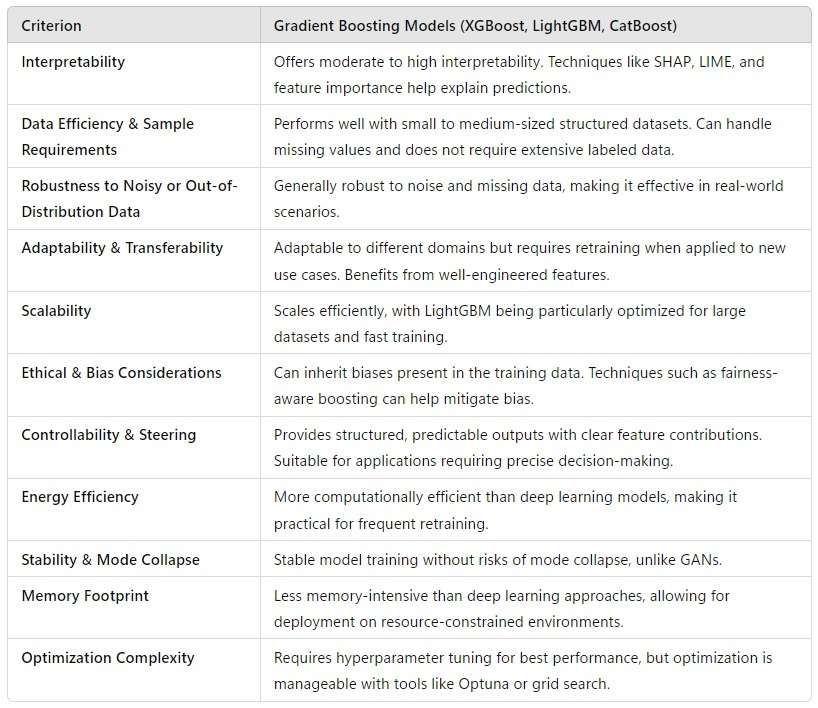
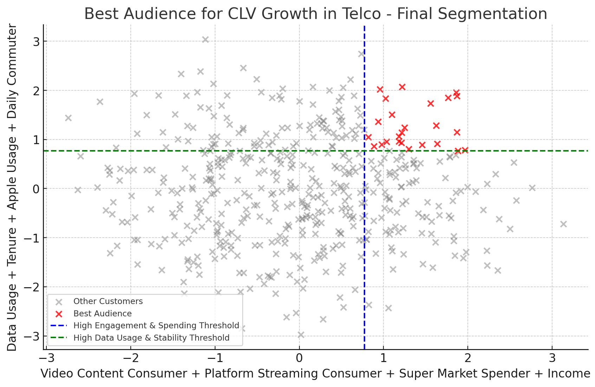
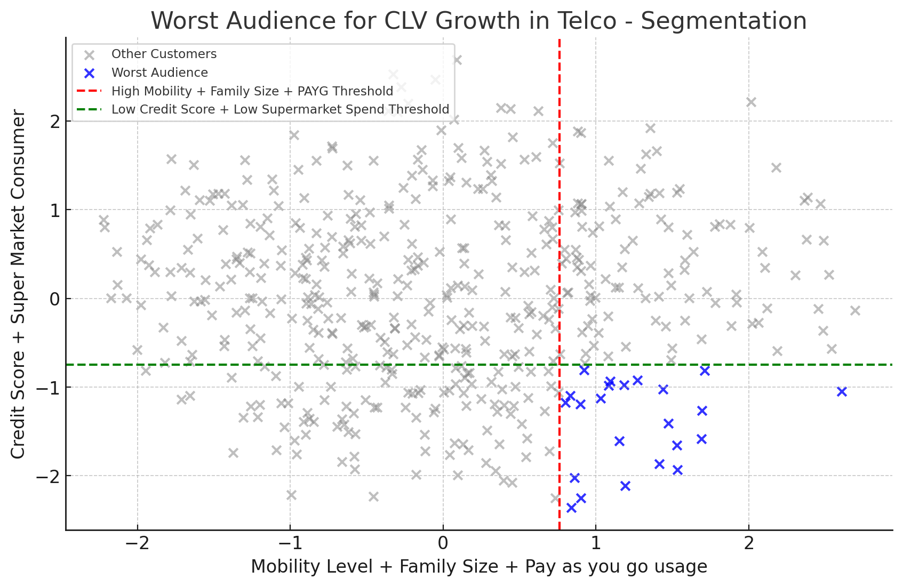

```{=html}
<header class="site-header">
    <h1 class="site-title">The Marketing Scientist</h1>
    <nav class="site-nav">
        <a href="../index.html" class="nav-link">🏠 Home</a>
        <a href="../articles.html" class="nav-link">📚 Articles</a>
    </nav>
</header>
```


# **Introduction**  

Audience targeting plays a crucial role in marketing performance. Traditionally, marketers have relied on **Lookalike Audiences (LALs)**, which replicate users similar to an existing seed audience (an audience of reference). However, with the advancements in data availability, AI and machine learning, I created a more powerful approach: **AI High-Value Audiences (AI HVAs)**.  

This article explores **the fundamental differences between Lookalike Audiences and HVAs**, how HVAs can **optimize audience targeting** and how can AI HVAs be deployed to Marketing Platforms. I will illustrate these concepts using **a case study from the telecommunications industry.**  


---

# **What Are AI High-Value Audiences (AI HVAs)?**  

AI-driven High Value Audiences (AI HVAs) go beyond traditional lookalike modeling by leveraging advanced machine learning techniques to identify and target the most impactful customers based on a business KPI. The process involves:  

1. **Using a seed audience** to bias the model with valuable business acumen, ensuring relevance to the brand’s strategic goals.  
2. **Incorporating comprehensive data sources**, including psychographic, sociographic, transactional, consumption, lifestyle, mobility, brand affinity, and search and purchase intent data.  
3. **Running a supervised ML model** to identify the audience that best increases overall **Customer Lifetime Value (CLV)** (in this case). The model estimates the **uplift or contribution** of each data point or variable to CLV.  
4. **Performing audience profiling** to make the audience addressable and ensure it can be effectively targeted through different platforms.   
  


---

# **1. Lookalike Audiences vs. My AI High Value Audiences (AI HVAs)**    

| Feature | Lookalike Audiences (LA) | High-Value Audiences (HVA) |
|---------|---------------------------|---------------------------|
| **Objective** | Find users statistically similar to a seed audience | Identify and prioritize audiences based on business KPIs |
| **AI Strategy** | Similarity-based statistical modeling | Explainable AI-driven optimization |
| **Data Inputs** | Demographic and behavioral data | Transactional, behavioral, engagement, and external signals |
| **Optimization Goal** | Audience expansion | ROI-driven performance targeting |
| **Actionability** | Broad targeting, limited transparency | Precision targeting with full explainability |  

  

Lookalike models focus on replicating the attributes of a given seed audience. In contrast, **HVAs are designed to directly optimize a business KPI** (e.g., revenue, churn reduction, average ticket, engagement, etc..). **Explainable AI (XAI)** is used to ensure transparency and actionability.  

---

### **2. Telco Industry Case Study: Identifying Churn Risk Segments**  

Using a realistic (yet not real) telco dataset, we analyze **which customer behaviors contribute to churn.** We start by taking a look at the data required.  

- **Customer Behavior & Usage Patterns:** Call activity, data usage, SMS frequency and device type.  
- **Financial & Subscription Data:** Billing amounts, payment history, plan types and upgrade/downgrade patterns.  
- **Customer Service Interaction:** Call logs, satisfaction scores and resolution times.  
- **Churn Indicators:** Contract tenure, expiry, and service complaints.  
- **Lifestyle & Psychographics:** Hobbies, brand affinity, demographics and transactional behaviors.  
- **Salary & Economic Indicators:** Salary brackets and related mobility or spending data.  
- **Demographics:** Age, Gender, Family Size, etc..

This multi-dimensional framework enables an in-depth view of customer behavior.  Let's now dive into modeling technique selection.  


#### **Modeling Technique Selection**   

With the large ranges of needs, costs, business requirements and compliance requirements it's very important to select the best technique to model, considering all the possible trade-offs. Below is a table where I argue tree ensembles like XGB are the right way to move forward.  

  

Model training may require XGBoost Regression on CLV, due to its robustness and performance. However, for real-time inference, LightGBM is a more suitable choice, particularly in scenarios where compliance regulations mandate that data remain on the individual's mobile device. Real-time audience classification is essential, as different user actions and mobility patterns can dynamically trigger adjustments to audience strategies. LightGBM's efficiency ensures that these classifications happen seamlessly, enabling adaptive targeting based on user behavior.  

#### **Model Results**

As an example, one can find both the best and the worst audiences to target if you want to increase the overall CLV. We have done PCA to understand the 2 most important principal components in finding both audiences. The %variance expalained in by the principal components is decent in both cases, but I won't go into it right now, as it's not the focus of this article.

  

  

Both XGB models obtained a decent MAPE < 20%.  

# **3. Automating Cross-Channel Targeting with AI HVAs**

## **AI HVAs Marketing Automation**  

Automating platform execution to target **AI High-Value Audiences (AI HVAs)** derived from the XGB models involves integrating segmentation with marketing automation tools and data pipelines.

---

## **A. Data Preparation and Model Integration**
- **Feature Engineering & Model Execution**:  
   - The AI HVA model is run in a **cloud-based pipeline** (BigQuery, Snowflake, AWS, Databricks, etc.).
   - Outputs are stored in a structured **customer data warehouse** or **customer data platform (CDP)**.
   - Ensure the model output is easily consumable (e.g., scoring customers on a 0-100 scale or segmenting into tiers like Platinum, Gold, Silver).
   
- **Audience Segmentation & Scoring**:  
   - Implement **automated batch or real-time scoring** using ML pipelines in Vertex AI, AWS SageMaker or AutoML.  
   
---

## **B. Automated Data Flow to Ad & CRM Platforms**  
- **Automated Audience Syncing**:    
   - Use CDP or **Reverse ETL tools** (Hightouch, Census) to sync AI HVA segments with platforms like Google Ads, Meta, LinkedIn, DSPs, CRM tools (Salesforce, HubSpot) or email marketing platforms.
   - Implement live **triggers** for fast activation.  
     

- **Data Activation via API Integration**:  
   - Utilize API connections to send audience lists directly to ad platforms.  
   - **Example:**   
     - A new High Value member enters the database → API triggers an update to Meta Custom Audiences & Google Customer Match.  
   - If real-time **APIs are not available**, use **scheduled batch uploads**.  

---

## **C. Real-Time Campaign Execution & Optimization**  

- **Automated Bid Adjustments**:  
   - Adjust **media spend & bidding** dynamically for HVA in programmatic DSPs, Google Ads, or Meta Ads Manager.  
   - Set **higher bids for high-score HVAs** in PPC campaigns.  

---

## **D. Cross-Channel Activation & Orchestration**
- **Omnichannel Personalization**:  
   - Sync HVA segments across **Email, SMS, Push Notifications, Paid Media, and Sales CRM**.  
   - Example:  
     - A **high value user** visits the website but doesn’t convert → Triggers **automated personalized email** & **remarketing ad campaign**.  

- **Journey Orchestration**:  
   - Use tools like **Braze, Adobe Journey Optimizer, or Salesforce Marketing Cloud** to create custom journeys for HVA.  
   - Example:   
     - If an HVA **opens an email but doesn’t convert**, trigger a **retargeting ad** + send a **personalized offer via SMS**.  

---

## **E. Automated Performance Tracking & AI Optimization**
- **Real-time Analytics & Reporting**:
   - Automate **HVA performance dashboards** in Looker, Power BI, or Tableau.
   - Use **auto-tagging** in Google Analytics to track conversions.

- **Auto Refresh HVA Models**:
   - Set up **scheduled model retraining** every week/month.
   - Example: **If a user’s behavior shifts, they exit HVA targeting automatically**.

---

## **Tech Stack for End-to-End Automation**
| **Function** | **Tech Stack Examples** |
|-------------|-------------------------|
| **Modeling & Scoring** | Google Vertex AI, AWS SageMaker, Databricks, Snowflake |
| **Data Pipelines** | Apache Airflow, DBT, Fivetran, Prefect |
| **Audience Syncing** | Hightouch, Census, mParticle, Segment |
| **Media Execution** | Google Ads, Facebook Ads, DV360, The Trade Desk |
| **CRM & CDP** | Salesforce, HubSpot, Adobe Experience Cloud |
| **Campaign Automation** | Braze, Iterable, SFMC, Klaviyo |
| **Performance Tracking** | GA4, Looker, Power BI, Tableau |

---

## **Key Benefits of Automation**
✅ **Eliminates manual segmentation & list uploads**  
✅ **Live activation** → Reduces lag between HVA identification & campaign execution  
✅ **Improved efficiency** → Automates audience selection.  
✅ **AI optimization** → Dynamically adapts campaigns based on engagement & CLV  


---

# **Conclusion**

AI HVAs represent a **fundamental shift from traditional Lookalike Audiences** by leveraging **both audience selection and cross-channel engagement.** Furthermore, **automating cross-channel targeting** ensures **maximum efficiency in ad spend and customer engagement.**  

---

```{=html}
<div class="connect-section">
  <div class="linkedin-button">
    <a href="https://www.linkedin.com/in/themarketingscientist" target="_blank">
      <i class="bi bi-linkedin"></i>
      The Marketing Scientist
    </a>
  </div>
</div>
```