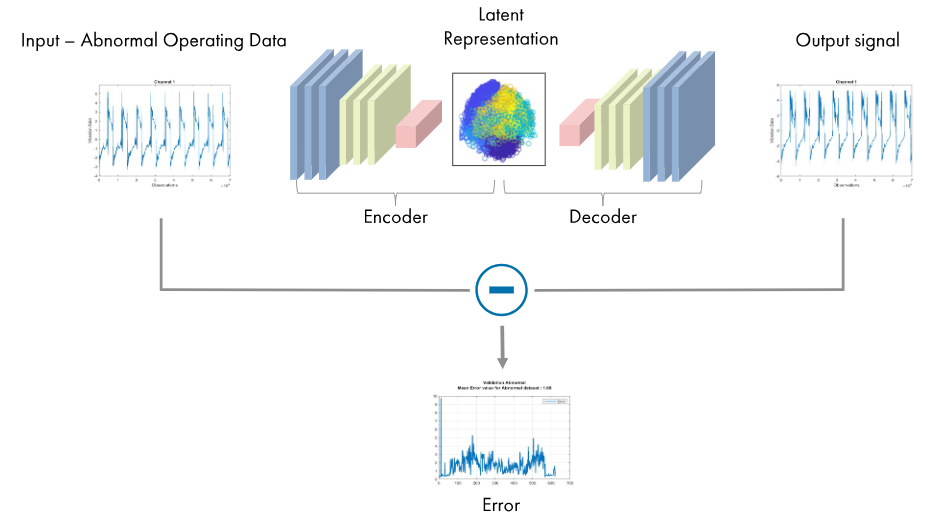
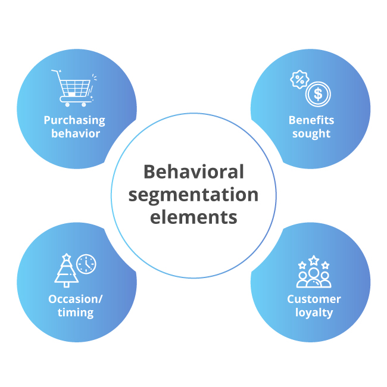
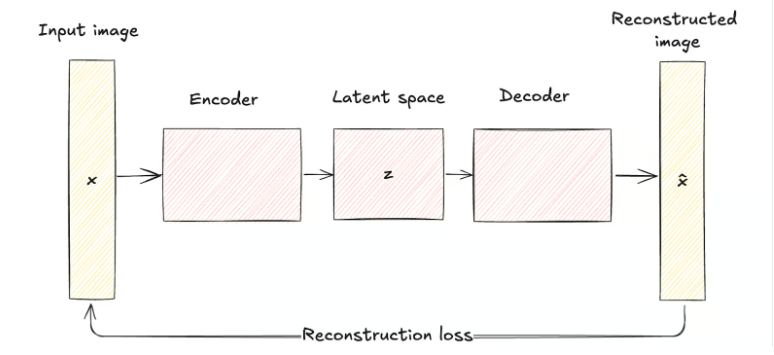

```{=html}
<header class="site-header">
    <h1 class="site-title">The Marketing Scientist</h1>
    <nav class="site-nav">
        <a href="../index.html" class="nav-link">🏠 Home</a>
        <a href="../articles.html" class="nav-link">📚 Articles</a>
    </nav>
</header>
```


# Introduction

The marketing and advertising industry has largely ignored **unsupervised deep learning**   

Advertising holdings have spent their time and resources trying to fix a broken narrative against their measurement bias with linear regressions. On the other hand, Marketing AI boutiques have been created in the same era of Generative AI and consultancy firms went from supervised learning directly to Generative AI. 

This **Undiscovered Transitional Species Saga** aims to explore and defend the business case for Marketing Deep Learning models skipped in the abnormal AI Maturity progression that hype and salesy overcommitment has put us in.  

Autoencoders significantly improve recommendations, segmentation and customer journeys. Autoencoders are a form of **Representation Learning**, they offer advanced creative applications and considerable interpretability if correctly set up.

What are the symptoms of ignoring Autoencoders?


- ❌ Low Performance from recommendation and cross-selling engines.  
- ❌ Inconsistent customer segmentation.  
- ❌ Insufficient creative performance improvements.  


Autoencoders bridge these gaps.




---


# Why Autoencoders Matter for Marketing AI

Traditional **Marketing AI** models rely heavily on labeled data.  

- Churn models.    
- CLV predictions.      
- Attribution.    
- Audience and Creative Optimization.    
- Pretty much everything.      


However, **customer behavior is complex and unlabeled**. Autoencoders learn **latent representations** that reveal **deep behavioral patterns**.


---


# A couple of Marketing Use Cases for Autoencoders

## 1. Sparse Autoencoders → Interpretable Segmentation  
> The Objective: Transform high-dimensional behavioral data (e.g., purchase history, browsing patterns, app usage) into human-interpretable customer segments using sparse autoencoders (SAEs), which enforce sparsity in latent representations to uncover disjoint patterns.

**How It Works?**

**Sparse Autoencoders (SAEs)** are neural networks trained to reconstruct input (customer) data through a compressed latent layer. A sparsity constraint (e.g. L1 regularization or KL divergence) ensures only a small subset of neurons activate for any input data, forcing the model to encode data into disentangled features (e.g., "budget shopper," "premium loyalist", "impulse buyer", etc..).

 

**Behavioral Data Compression.**
Input: High-dimensional data (e.g., transaction frequency, product affinity, session duration, etc..).
Latent Space: Each active neuron in the sparse layer represents a prototypical customer trait (e.g., "responds to discounts", "nighttime app user"). This allows marketing and sales teams to identify and describe a comprehensive set of customer prototypes.

**Segment Identification:**
Cluster latent codes (sparse vectors) to group customers with similar activation patterns. Unlike traditional clustering (e.g. k-means), **SAEs** automatically learn meaningful variations, removing guesswork from customer variable selection.


## 2. VAEs (Variational Autoencoders) → Brand Attributes Style for Ad Creatives & Branding  
> The Objective: Capture brand visual patterns and reconstruct them for better ad creative performance while maintaining brand guidelines.

 

> Variational Autoencoders (VAEs) represent a sophisticated approach to brand-aligned visual generation, offering a structured methodology for creating cohesive ad creatives maintaining brand identity. Unlike traditional autoencoders, VAEs treat visual representations as probabilistic distributions, allowing for realistic and sensible variations in the generated creatives, enforcing brand consistency.

The power of VAEs lies in their ability to learn continuous, structured representations of visual styles. Rather than memorizing specific designs, they capture the underlying patterns, styles and distributions that define brand aesthetics. This is achieved through:

**- Probabilistic Encoding**

- Maps input ad creatives to probability distributions.
- Enables smooth transitions between styles.
- Controls variation in reconstructed ad creatives.


**- Structured Latent Space**

- Organizes style elements systematically.
- Separates independent design factors.
- Enables targeted modifications.


---


# Why Agencies, Boutiques & Firms Have Skipped This Opportunity

🚧 Rule-based heuristics & inaccurate linear models dominate.  
🚧 **Lack of data engineering infrastructure for deep learning**, prioritizing legacy investments.  
🚧 Fear of "black box" models. These fears are unjustified, see coming articles on Interpretability.  

Many companies prefer the **status quo**, but it’s holding them back from transformative business results.


---


# The Future of Autoencoders in Marketing AI

✅ Brands must invest in **scalable AI platforms** like **Vertex AI, SageMaker and Databricks.**  
✅ Agencies should shift from **outdated segmentation** to **representation learning.**  
✅ AI practitioners must integrate **Deep Learning & Actionable Marketing Intelligence.**

The future of **Marketing AI** can't only be more uncertain attribution. It's high time we move to **Unsupervised & Deep**.

---

```{=html}
<div class="connect-section">
  <div class="linkedin-button">
    <a href="https://www.linkedin.com/in/themarketingscientist" target="_blank">
      <i class="bi bi-linkedin"></i>
      The Marketing Scientist
    </a>
  </div>
</div>
```