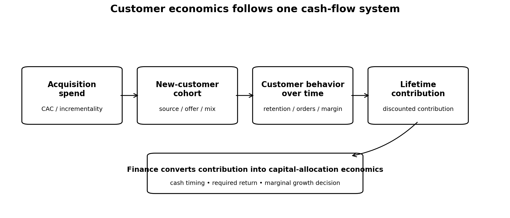
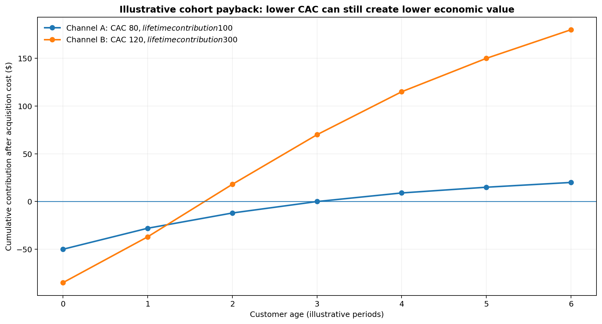

```{=html}
<header class="site-header">
    <h1 class="site-title">The Marketing Scientist</h1>
    <nav class="site-nav">
        <a href="../index.html" class="nav-link">Home</a>
        <a href="../articles.html" class="nav-link">Articles</a>
    </nav>
</header>
```

Most companies claim to understand their customer economics.

- They track CAC.
- They calculate LTV.
- They monitor retention.
- Marketing reports ROAS and CAC.
- Finance watches contribution margin.
- CRM teams analyze repeat purchases.

Then each metric gets managed by a different team, with a different dataset, over a different time horizon. The result is a fragmented view of something that is one economic system.

Acquisition, retention, and unit economics describe different stages of the same cash flow. 

*A channel can look expensive because its CAC is high while acquiring customers who retain exceptionally well. Another can look efficient because its CAC is low while bringing customers who never purchase again.*

Both channels may report attractive ROAS depending on the measurement window. Their economics can be completely different.

{width=95% fig-align="center"}

## CAC stops too early

CAC is one of the most useful metrics in growth management, and one of the easiest to abuse. At its simplest:

$$
CAC = \frac{\text{Total Acquisition Cost}}{\text{New Customers Acquired}}
$$

The problem begins when CAC is the only decision criteria.

Suppose Channel A acquires customers for \$80 and Channel B acquires them for \$120. A performance dashboard will immediately prefer Channel A. *But CAC says nothing about what happens after acquisition.*

If customers from Channel A contribute \$100 over their economic lifetime while customers from Channel B contribute \$300, then the preference changes.

In practice, organizations repeatedly optimize the first part of the customer relationship because it is the part they can observe the fastest.

Media platforms reinforce this behavior. Acquisition teams are usually evaluated against short-term conversion metrics. Finance sees customer value at a much more aggregated level. CRM analyzes retention after the acquisition decision has already happened.

The customer moves through one system while the organization measures many.

## Retention changes what an acquired customer is worth

For a cohort acquired at time $c$, its economics are distributed across future periods rather than concentrated entirely in the acquisition period. A simplified representation is:

$$
LTV_c = \sum_{t=0}^{T} m_{c,t}
$$

where $m\_{c,t}$ is the contribution margin generated by cohort $c$ at customer age $t$.

Two acquisition channels producing the same number of first transactions can create very different amounts of economic value if their customers have different purchasing behavior, order values, product mixes, servicing costs or gross margins. *The source of acquisition is a part of customer economics and LTV.*

This is only one of the many reasons why Average LTV is a dangerous measure. A single company wide LTV treats customers as economically interchangeable.

Customers acquired through different channels can behave differently. *Customers acquired under heavy discounting can behave differently from full-price customers. Product, geography, acquisition period, device, promotion strategy and many other variables can create cohorts with different value trajectories. Truly understanding customer contribution patterns as a function not only of their purchasing behavior but also as a function of their demographics, psychographics, individual finance, brand affinity, mobility and media consumption patterns.*

A company scaling acquisition while customer quality deteriorates can report growth for quite some time, as far as CAC remains acceptable and revenue increases.

*The deterioration becomes evident later, when weaker cohorts fail to generate the expected retained revenue. **By then, a substantial amount of capital may already have been deployed.***

## Revenue can hide deteriorating customer economics

Aggregate revenue is especially forgiving. Revenue in any period is produced by multiple generations of customers. Some arrived today, others arrived months ago and are still purchasing.

A simple cohort representation is:

$$
Revenue_t = \sum_{c \leq t} Revenue_{c,t}
$$

where $Revenue\_{c,t}$ is the revenue in period $t$ generated by customers acquired in cohort $c$.

Current revenue contains both current acquisition performance and the accumulated effects of earlier acquisition.

- *A mature customer base can therefore mask a weak current acquisition.*
- Strong historical cohorts continue generating revenue while newer cohorts deteriorate.

The opposite can also happen. A company making aggressive investments in high-quality acquisition can look inefficient in the short run because much of the economic return has not arrived yet.

This creates a familiar argument between Marketing and Finance.

- Marketing: Acquisition is working. 
- Finance: The payback is too slow.

Both may be looking at valid numbers. They may be looking at different portions of the customer cash-flow curve.

{width=95% fig-align="center"}

## LTV helps if LTV is translated into economics

Connecting CAC to LTV is an improvement:

$$
\frac{LTV}{CAC}
$$

But this ratio creates false confidence. The numerator contains revenue when it should contain contribution.

- Future value may be extrapolated from immature cohorts.
- Retention assumptions may come from customers acquired under very different sources or media mix.
- Acquisition costs may exclude important variable costs.

An average historical LTV can be applied to every incremental customer as if the next customer will behave like the average customer already in the database. This assumption fails as a company scales: *The customers available at \$50 million of revenue are not necessarily the customers available at \$500 million.* Note that this failure can also arise even if you continuously use different company-wide LTVs across time.

***Growth:***

- *Changes channel mix and auction pressure.*
- *Pushes companies into broader audiences, producing diminishing returns on scale and acquisition cohorts inefficiency over time.*
- *Changes promotions*
- *Changes product mix*
- *Changes Coverage*
- *Changes customer quality.*

*Marginal customer economics deteriorate even while average customer economics look fine.*

*This is one reason why a historical LTV ratio should never be treated as an unlimited license to spend.*

## Customer economics should be marginal

Executives need to understand the economics of the next unit of growth: Where and when to spend the next dollar. This requires connecting incremental acquisition cost with the expected value of the customers acquired at that margin. A good decision metric for this is:

$$
\frac{\text{Expected Lifetime Contribution}}
{\text{Marginal Acquisition Cost}}
$$

Expected lifetime contribution depends on what the next customers do after acquisition. *This makes customer economics a joint problem across Marketing, Product, CRM, Pricing and Finance:*

- Marketing influences which customers enter.
- Product influences what they buy and whether they stay.
- Pricing and promotions influence both conversion rates and margin, as well as loyalty and branding.
- CRM influences subsequent purchases.
- Finance determines whether the resulting cash flows clear the company’s EVA for stakeholders.

These functions can still have separate operating metrics. But the capital-allocation decision has to connect them. *Otherwise, every team can hit its KPI while the economics deteriorate.*

## Short-term efficiency can fight long-term value

One of the easiest ways to improve acquisition metrics is to move toward customers already closest to conversion.

- Retarget harder.
- Increase branded search.
- Use deeper discounts.
- Concentrate spending where conversion probability is highest.
- CAC can improve.
- Reported ROAS can improve.
- Growth can still weaken.

*There is a tradeoff between harvesting existing demand efficiently and creating new customer cohorts that produce future value.*

Proper customer economics should make this tradeoff visible, forcing the company to trace value beyond acquisition. 

- *A channel with slower payback can be economically superior if it acquires customers with stronger future contribution.*
- *A channel with extraordinary short-term ROAS can be less attractive if most of the measured conversion would have occurred anyway* *or if the resulting customers have weak downstream economics.*

*Once acquisition quality enters the discussion, “Which channel has the best ROAS?” starts to look like an incomplete question.*

## Growth creates cohorts, not just conversions

*Marketing spending does not merely buy conversions; it helps create cohorts of customers. Each cohort has an acquisition cost, a retention curve, a revenue trajectory and a contribution profile.*

That is why acquisition, retention and unit economics cannot remain separate executive conversations. A company can optimize any one of these pieces and still make a poor growth decision.

The useful management problem is to understand the economics of the whole customer relationship, then decide how much of the next dollar of growth is actually worth purchasing.

## The measurement stack should follow the customer cash flow

Different measurement tools observe different parts of this system.

- Experiments can estimate incremental acquisition and provide the heaviest evidence, but it must be connected to the rest of the measurement ecosystem in order to become valid for financial decisions.
- MMM can estimate how media spend changes acquisition or revenue at an aggregate level. It should be based on Experimentation, but it needs a connection to media and customer economics.
- Cohort revenue and retention modeling lies at the core of customer economics decisions. It must be tied to MMMs, in order to ensure incremental effects are supported by evidence and to separate customers that would have converted anyway from those that converted thanks to media investments.
- Finance data converts revenue into contribution and cash.

All these should connect. This chain is more reliable than optimizing a collection of disconnected ratios:

- Maybe incrementality is uncertain.
- Maybe retention curves are immature.
- Maybe margins differ substantially across products or customer segments.
- Maybe a specific media channel is not profitable.

Fortunately, these are all problems that can be measured and improved using evidence.

```{=html}
<section class="article-cta">
  <p class="article-cta-question"><strong>Are your acquisition metrics secretly hiding your real customer economics?</strong></p>
  <p class="article-cta-description">
    I advise executives on measurement strategy, marketing economics, and Marketing Science product and vendor decisions.
  </p>
  <a
    class="article-cta-button"
    href="https://calendly.com/andres-themarketingscientist/some-context"
    target="_blank"
    rel="noopener noreferrer"
  >
    Schedule a call
  </a>
</section>
```

```{=html}
<div class="connect-section">
  <div class="linkedin-button">
    <a href="https://www.linkedin.com/in/themarketingscientist" target="_blank">
      <i class="bi bi-linkedin"></i>
      The Marketing Scientist
    </a>
  </div>
</div>
```
