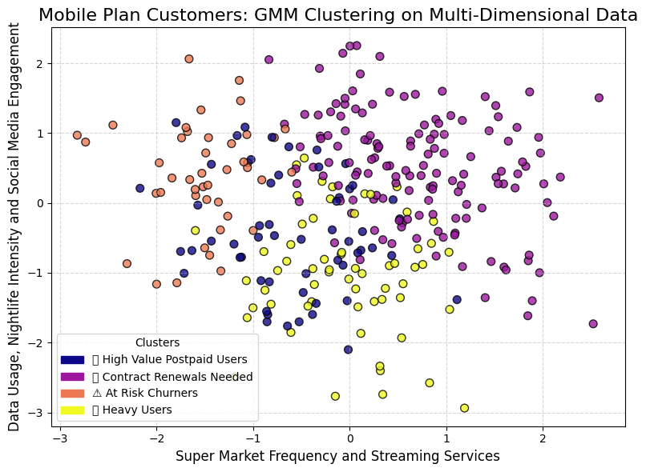
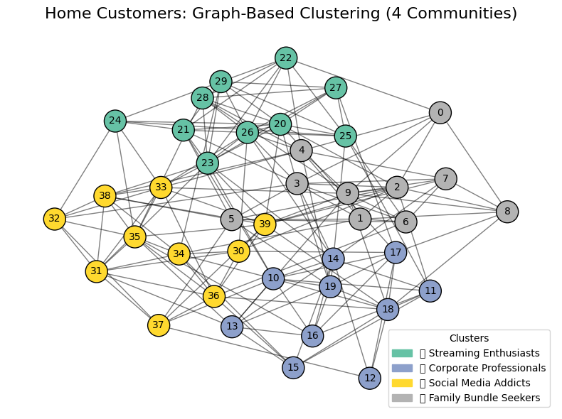

```{=html}
<header class="site-header">
    <h1 class="site-title">The Marketing Scientist</h1>
    <nav class="site-nav">
        <a href="../index.html" class="nav-link">🏠 Home</a>
        <a href="../articles.html" class="nav-link">📚 Articles</a>
    </nav>
</header>
```

# Introduction  

Effective customer segmentation is key for delivering personalized experiences, increasing ARPU (Revenue Per User) and reducing churn. With a growing volume of data from usage and billing to psychographics and lifestyle, we are uniquely positioned to leverage advanced machine learning algorithms for hyper personalized targeting.   

This article was written as an example of a Telco segmentation. This example is not based on real life data, **it uses realistic data** and offers results and insights, some of which are common in the Telco industry (not all of them). 

My purpose with this article is to show a structured aproach towards segmentation with business strategy in a telco corporate context, outlining the business context and objectives, the necessary data sources, and presenting traditional and state of the art clustering techniques. A focus is given to advanced methods beyond the classic RFM (Recency Frequenzy Monetization) analysis, including new approaches for home services segmentation.  
    


# 1. Why We Need Segmentation  

  

Telcos face multiple challenges:  

- **Customer Retention:** Identifying at-risk users early and implementing proactive interventions.  
- **Revenue Optimization:** Tailoring offers to maximize ARPU and boost upselling opportunities.  
- **Personalized Customer Experience:** Leveraging diverse data to create targeted marketing campaigns.  
- **Churn Reduction:** Using predictive analytics to prevent customer drop-off.  

Effective segmentation transforms raw data into actionable insights and drives competitive advantages in a dynamic market.  

# 2. Business Needs, Objectives and Context  

**Typical Telco Priorities:**  

Despite segmentaiton itself is not the end goal, it is a prerequisite to approach the main business objectives.

- **Retention:** Engage and retain at-risk customers through targeted interventions.  
- **Revenue Per User:** Design cross-selling and upselling strategies by understanding customer spending habits.  
- **Enhanced Customer Experience:** Personalize products and services using a deep understanding of customer behavior.  
- **Churn Reduction:** Use predictive models to identify and prevent potential churn.  


Aligning segmentation strategies with these priorities allows telcos to create agile marketing strategies and improve overall business performance.  

# 3. Data Required for Segmentation  

A comprehensive segmentation model leverages a blend of data types:  

- **Customer Behavior & Usage Patterns:** Call activity, data usage, SMS frequency and device type.  
- **Financial & Subscription Data:** Billing amounts, payment history, plan types and upgrade/downgrade patterns.  
- **Customer Service Interaction:** Call logs, satisfaction scores and resolution times.  
- **Churn Indicators:** Contract tenure, expiry, and service complaints.  
- **Lifestyle & Psychographics:** Hobbies, brand affinity, demographics and transactional behaviors.  
- **Salary & Economic Indicators:** Salary brackets and related mobility or spending data.  

This multi-dimensional framework enables an in-depth view of customer behavior for actionable segmentation.  
   

# 4. Machine Learning Algorithms Selected and Advanced Techniques  

Traditionally, methods like RFM analysis and K-Means clustering have been popular for telco segmentation. However, state-of-the-art techniques now allow for deeper insights:  

- **Deep Embedding Clustering:** Use autoencoders to learn latent representations that capture non-linear relationships, refining segmentation beyond RFM.  
- **Gaussian Mixture Models (GMM):** Offers soft clustering by assigning probabilities to each customer for belonging to a segment, capturing overlapping behaviors.  
- **Graph-Based Clustering for Home Users:** Graph-based clustering can reveal community structures in home services, where network relationships (e.g., similarities in broadband usage or support interactions) matter.  


In this exercise, we demonstrate one modern clustering method per vertical:  

- **Pay as You Go:** Agglomerative Clustering on multi-dimensional RFM and salary data.  
- **Mobile Plan:** Gaussian Mixture Models on usage, spend, contract tenure and salary.  
- **Home:** Graph-based clustering via community detection on a stochastic block model.  


# 5. Visualizing Customer Segments  

  


  


  


The segmentation analysis provides valuable insights into different customer groups across prepaid, postpaid, and home service plans. By leveraging advanced clustering techniques, we have uncovered patterns that highlight behavioral differences and potential business opportunities.  

Among **pay-as-you-go customers**, frequent small rechargers show reduced engagement in nightlife and social media but display stronger affinities toward streaming services and supermarket purchases. Interestingly, **churn risk factors align with a reduction in these same behaviors**, suggesting that lifestyle patterns play a critical role in retention strategies.  

For **mobile plan customers**, contract renewal users tend to have high spending behaviors, positioning them as an essential segment for engagement strategies. The contrast between **high-value users and at-risk churners**, who both show low engagement in streaming services, suggests that their underlying motivations may be similar. Further investigation into their lifestyle and usage trends could refine marketing and retention tactics.  

Finally, **home customers exhibit a clear distinction between corporate professionals and streaming enthusiasts**, two well-segmented groups. However, **social media addicts and bundle seekers are more widely distributed across the customer base**, indicating that these segments may require more granular feature differentiation.  

These findings emphasize the importance of multi-dimensional segmentation approaches. Beyond traditional spending and usage metrics, **lifestyle behaviors provide deeper insights into customer retention and engagement strategies**. Future steps could involve integrating additional data sources—such as location patterns or sentiment analysis—to further refine segmentation models and predict customer lifetime value more accurately.  


As more data arrives and new AI models provide more information about customers, we want to ensure we take a closer look at intercluster transitions of **high business impact:**    


## High-Value Customer Movement

### 🔄 Positive Transitions (Revenue Growth & Loyalty)

✅ **Potential Postpaid Migrators → High-Value Postpaid Users**  
Customers increasing prepaid recharges and spending can be converted to postpaid.  
*Strategy:* Offer exclusive postpaid deals, device financing and loyalty rewards.  

✅ **High-Value Postpaid Users → VIP / Premium Postpaid Users**  
Users upgrading to premium plans, adding family lines, or bundling home services.  
*Strategy:* Personal concierge services, unlimited data plans, bundled home broadband.  

✅ **Frequent Small Rechargers → Bulk Rechargers / Mid-Tier Prepaid Users**  
Budget-conscious users shifting towards larger recharge amounts.  
*Strategy:* Offer cashback for bulk recharges, introduce loyalty rewards.  

✅ **Data-Heavy Prepaid Users → Unlimited Data / 5G Premium Users**  
Users frequently exceeding data limits transitioning to high-speed, unlimited plans.  
*Strategy:* Offer unlimited YouTube, TikTok, Netflix or social media packs.  

✅ **Work-from-Home Users → Multi-Device / Family Bundle Users**  
Customers adding multiple broadband connections or upgrading internet speed.  
*Strategy:* Promote smart home integration, bundled streaming & security solutions.  

---

## Churn Prevention & Retention-Based Transitions

### ⚠️ Negative Transitions (Risk of Churn, Downgrades, Disengagement)

❌ **High-Value Postpaid Users → At-Risk Churners**  
Customers reducing usage, delaying payments, or contacting support for complaints.  
*Strategy:* Early engagement with personalized retention offers, improved support.  

❌ **Contract Renewals Needed → At-Risk Churners**  
Customers nearing contract expiration but showing signs of disengagement.  
*Strategy:* Proactive renewal offers, device discounts, flexible payment options.  

❌ **Data-Heavy Users → Budget / Low Usage Customers**  
Previously heavy data users downgrading or showing lower engagement.  
*Strategy:* Personalized discounts on data bundles, retention surveys.  

❌ **Streaming Enthusiasts → Subscription Cancellations**  
Customers canceling bundled streaming services due to pricing concerns.  
*Strategy:* Offer subsidized streaming plans, limited-time discounts.  

❌ **Service Frustrated Customers → Churn / Competitor Migration**  
Customers with repeated complaints, unresolved service issues.  
*Strategy:* Priority issue resolution, free upgrades, competitor price matching.  

---

## Lifestyle & Economic-Based Transitions

### 📊 Salary-Driven & Lifestyle Transitions

🔄 **Young Professionals → Business Users / Corporate Postpaid**  
Career progression leads to increased telecom needs (work-from-home, travel).  
*Strategy:* Offer business postpaid plans, corporate discounts, remote work bundles.  

🔄 **Students → Mid-Tier Customers**  
Students moving into full-time jobs, increasing telecom usage & disposable income.  
*Strategy:* Promote postpaid entry-level plans, device financing.  

🔄 **Parents / Family Users → Home Service Bundlers**  
Families consolidating broadband, streaming, and multiple phone lines.  
*Strategy:* Create customized family bundles with unlimited data & streaming.  

🔄 **Budget-Conscious Users → Mid-Tier Subscribers**  
Users transitioning from prepaid to postpaid as income increases.  
*Strategy:* Offer flexible installment-based phone plans & credit-based billing.  

---

## Competitor Migration & Market Dynamics

### 🔄 Competitive Landscape-Based Transitions

🏆 **Competitor Migrants → New Customers (Win-Back Strategy)**  
Users switching from other carriers due to price, service issues or promotions.  
*Strategy:* Welcome bonuses, free migration offers, exclusive early discounts.  

❌ **Existing Customers → Competitor Churners**  
High-value customers moving to competitors due to dissatisfaction.  
*Strategy:* Competitor price matching, better contract flexibility.  

---

## Why Intercluster Transitions Matter?

📊 Understanding customer movement helps predict behavior before it impacts revenue.  Proactive segmentation ensures timely interventions for churn, upgrades and revenue growth.  
💡 I will discuss machine learning optimization for churn, CLV and other Customer KPIs in upcoming articles in this saga. 

---


## BUSINESS STRATEGY FOR SEGMENTATION

- **Actionability**: Can the business act on the segments (e.g., targeted marketing, personalized offers, differentiated pricing)?  
- **Stakeholder Validation**: Do marketing, sales and product teams find the segments useful and intuitive for decision-making?  
- **Feasibility**: Can the segmentation be operationalized?  
- **Ease of Identification**: Can frontline teams (sales, customer support, marketing) easily recognize and apply segmentation in real-world scenarios?  
- **KPIs Tracking**: Monitor revenue, engagement, retention and acquisition cost improvements for each segment.  
- **Get stakeholder buy-in**: Ensure sales, marketing and leadership understand and agree with the segments.  


### Check: Can You Describe Each Segment in Business Terms?

If each segment can be easily described in a way that makes sense to business leaders, marketing and client fronting teams (e.g., "Price-Sensitive Shoppers," "Loyal High-Spenders," "One-Time Buyers"), and clear strategies can be built around them, then the segmentation is likely practical and valuable.  

### Organizational Challenge in AI & ML Adoption

Accepting a customer segmentation can be **political** because its success often depends on stakeholder buy-in rather than purely on statistical rigor. If marketing, sales and leadership teams don’t intuitively understand or trust the segmentation, they won’t use it.  

This means:  

- A segmentation that aligns with existing business intuition is more likely to be accepted.  
- If key stakeholders feel excluded from the process, they might reject it for political reasons.  
- Segmentation may be forced to fit internal narratives and rejected if it can't do so.  

To ensure real adoption, **involving stakeholders early and aligning segmentation with business priorities** is more important than modeling itself. This highlights a **fundamental organizational challenge in AI and ML adoption**: the gap between **technical rigor, usefulness and politics**. AI and ML are often misaligned with business realities, politics and organizational culture.


---

```{=html}
<div class="connect-section">
  <div class="linkedin-button">
    <a href="https://www.linkedin.com/in/themarketingscientist" target="_blank">
      <i class="bi bi-linkedin"></i>
      The Marketing Scientist
    </a>
  </div>
</div>
```