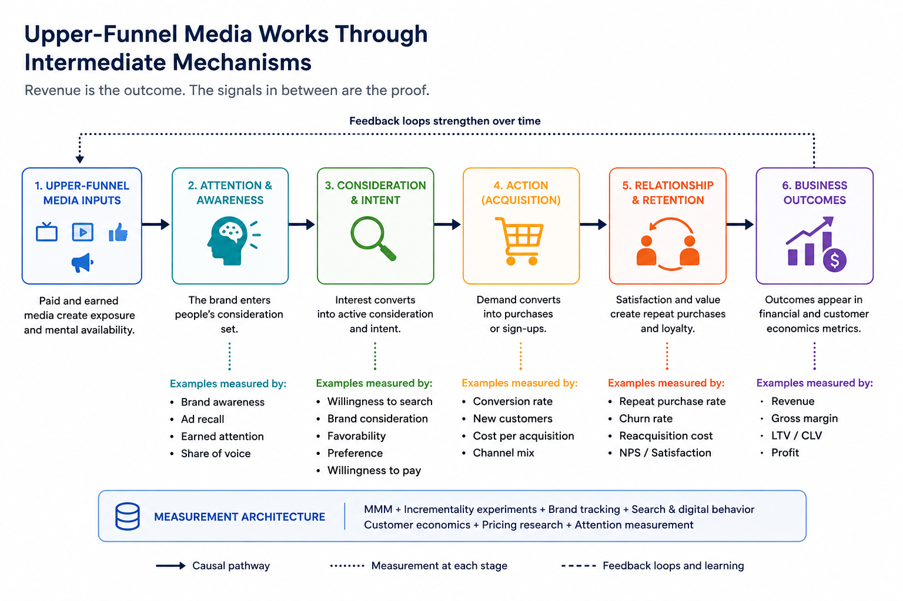
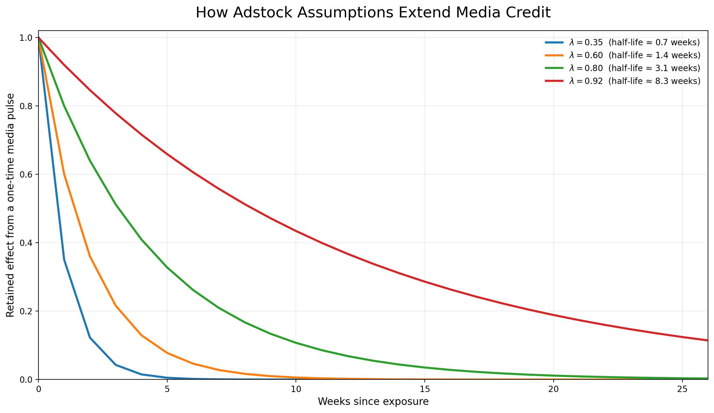

```{=html}
<header class="site-header">
    <h1 class="site-title">The Marketing Scientist</h1>
    <nav class="site-nav">
        <a href="../index.html" class="nav-link">🏠 Home</a>
        <a href="../articles.html" class="nav-link">📚 Articles</a>
    </nav>
</header>
```

# **Introduction**

Your MMM may be under-crediting upper-funnel media.

But I would frame the issue slightly differently, because the problem is not as simple as giving television, video or another “brand” channel a longer adstock.

A channel is not inherently upper funnel.

The same channel can play very different roles depending on:

- targeting;
- creative;
- audience;
- placement;
- frequency;
- offer;
- campaign objective.

Video can introduce a brand, generate consideration, retarget an existing visitor or support a direct-response offer. Paid search can capture existing demand, but generic search can also introduce a brand to buyers who had not considered it before.

The funnel role belongs to the campaign and the execution, not permanently to the channel name.

This also creates a problem for MMM when data is aggregated too broadly. A single “video” or “social” variable may contain campaigns performing several different jobs. The model then returns one contribution estimate for media that did not have one consistent role.

---

# **Upper-funnel contribution should not be identified from revenue alone**

Revenue is usually the main business outcome in MMM.

However, upper-funnel media can affect the business through several pathways before the full impact appears in revenue:

- awareness;
- earned attention;
- salience;
- willingness to search;
- consideration;
- willingness to pay;
- organic acquisition;
- customer quality;
- retention;
- re-acquisition costs;
- downstream conversion efficiency;
- customer lifetime value.

A revenue model may capture part of this value, especially when the time series is long and the media variation is informative. But revenue alone gives the model very little help in distinguishing delayed media impact from every other slow-moving force affecting the business.

A model may assign future revenue to media because media created demand.

It may also assign future revenue to media because media investment happened to move alongside:

- category growth;
- changes in distribution;
- pricing;
- promotions;
- competitor weakness;
- product improvements;
- seasonality;
- economic conditions;
- an unobserved trend.

These explanations can look similar in a revenue time series.

The difficulty increases as the claimed media impact becomes longer.

---

# **Longer-term impact requires more assumptions**

The longer the term of the impact estimation, the more the result depends on assumptions around:

- lag;
- decay;
- parameter stability;
- persistence of media effects;
- separation from baseline;
- separation from non-media drivers;
- stability of the competitive and economic environment.

A simple geometric adstock can be written as:

$$
A_t = x_t + \lambda A_{t-1}
$$

where:

- \(x_t\) is current media activity;
- \(A_t\) is the accumulated media stock;
- \(\lambda\) controls how slowly the effect decays.

A higher value of \(\lambda\) allows media to keep receiving credit for longer.

The implied half-life is:

$$
h = \frac{\log(0.5)}{\log(\lambda)}
$$

Small changes in the decay parameter can produce very different stories about how long media continues to affect the business.

{width=95% fig-align="center"}

A longer decay can be appropriate. Brand effects do not necessarily disappear within one or two weeks.

But a long tail also increases the overlap between media and slow-moving baseline factors. Once media retains credit for several months, the model has to separate that contribution from trend, category growth, pricing, distribution and other persistent variables.

That separation is often fragile when:

- the observable time series is short;
- spend changes slowly;
- several media channels move together;
- the model estimates many parameters;
- there are few periods with low or zero investment;
- important non-media factors are missing;
- business conditions change during the estimation period.

A long adstock does not prove a long-term effect. It allows the model to estimate one.

The estimate still needs support.

---

# **Intermediate mechanisms should show up somewhere**

If a model claims that upper-funnel media drives long-term revenue because it builds awareness, salience or consideration, we should expect some movement in the mechanisms connecting exposure to revenue.

A simplified path may look like this:

$$
\text{Media}
\rightarrow
\text{Attention and awareness}
\rightarrow
\text{Search and consideration}
\rightarrow
\text{Customer behavior}
\rightarrow
\text{Revenue}
$$

{width=95% fig-align="center"}

The exact pathway will vary by brand and campaign.

For one advertiser, branded search may be a useful intermediate signal. For another, the relevant movement may appear in awareness, direct traffic, willingness to pay, customer quality or retention.

No individual brand metric is perfect. These measures can be noisy, infrequent and affected by survey design. Some effects may also take time to appear.

Still, the proposed media story should leave evidence somewhere.

If the argument is that media generated future demand, but there is no movement in awareness, attention, search, consideration, customer quality, retention or any other relevant signal, confidence in the revenue attribution should fall.

The model may still be correct. But the long-term effect is harder to distinguish from trend, seasonality, competitor effects or omitted variables.

---

# **Brand measurement becomes part of MMM validation**

Brand measurement should not sit completely outside the MMM process.

It can help evaluate whether the model’s explanation makes sense.

For example, imagine two MMM specifications:

- Model A assigns a modest, shorter-lived contribution to video.
- Model B assigns a larger contribution that persists for several months.

Suppose Model B also aligns better with:

- brand-lift studies;
- changes in awareness;
- branded search;
- direct traffic;
- consideration;
- customer acquisition quality;
- later retention.

That does not automatically prove Model B is correct. But the result has more support than a long-term revenue coefficient standing on its own.

Now assume the opposite. Model B assigns a large long-term contribution, but:

- brand indicators do not move;
- search behavior does not change;
- customer quality remains flat;
- experimental evidence is weak;
- the result disappears when trend specification changes.

That should create skepticism, even when the model fits revenue well.

Brand and intermediate metrics can help distinguish models that explain the same sales history but imply very different causal stories.

---

# **Do not automatically add every brand metric as a control**

There is also a modeling risk here.

If awareness or consideration is part of the pathway through which media affects revenue, controlling for it directly in the revenue equation may remove part of the media effect.

For example:

$$
\text{Media}
\rightarrow
\text{Awareness}
\rightarrow
\text{Revenue}
$$

If awareness is inserted as an ordinary control, the model may estimate media contribution after holding awareness constant. That may block the mediated effect we wanted to measure.

Brand metrics may be more useful as:

- outcomes in separate models;
- validation signals;
- calibration evidence;
- experiment outcomes;
- components of a mediation framework;
- evidence used during model selection.

The correct treatment depends on the causal role of the variable. Awareness can be a mediator in one analysis, a confounder in another context or simply a noisy proxy for an underlying demand state.

Adding it to the model without a clear causal rationale can create another problem while trying to solve the first one.

---

# **How an MMM can under-credit upper-funnel media**

Upper-funnel media may be under-credited when:

- decay is constrained to be too short;
- the outcome window is too narrow;
- the model only values the first transaction;
- retention and customer quality are excluded;
- search and other demand-capture channels receive credit for demand created elsewhere;
- brand investment changes too little to be identified clearly;
- spend is highly correlated with other channels;
- experimental results suggest more impact than the MMM recovers;
- the model ignores later improvements in organic demand or re-acquisition cost.

A brand campaign can have a modest immediate revenue effect and still improve customer economics later.

A model focused only on short-term sales may miss that value.

---

# **How an MMM can over-credit upper-funnel media**

Upper-funnel media may also be over-credited when:

- a long adstock absorbs trend;
- the model attributes category growth to media;
- decay is weakly identified and driven mainly by priors;
- media contribution remains high long after activity stops;
- the result changes sharply when non-media controls are added;
- correlated channels are not separated well;
- the model gives media credit during periods with little useful variation;
- intermediate demand signals do not support the claimed effect;
- experiments contradict the model;
- the contribution is unstable across time windows.

Extending the adstock can solve one bias and create another.

The appropriate decay should be tested, not selected because the channel has been labeled “upper funnel.”

---

# **What I would test**

For a channel receiving a large long-term contribution, I would examine at least the following.

## **Lag and decay sensitivity**

How much does contribution change across reasonable lag and decay assumptions?

If small parameter changes produce completely different ROI estimates, the model is telling us that the result is weakly identified.

## **Time-window stability**

Does the contribution remain credible when the model is estimated over different periods?

A long-term effect that only appears in one window may depend on a particular trend or business event.

## **Control sensitivity**

What happens when pricing, distribution, promotions, category indicators or competitor activity are introduced?

A sharp collapse in contribution may indicate that media was previously absorbing non-media variation.

## **Prior sensitivity**

For Bayesian MMM, how much of the result comes from the observed data and how much comes from the prior?

Priors are necessary, especially when data is weak. But the level of prior dependence should be visible.

## **Intermediate-signal alignment**

Do awareness, search, consideration, direct traffic, customer quality or another relevant metric move in a compatible direction?

The expected signal depends on the campaign. The model should be evaluated against that campaign’s proposed mechanism.

## **Experimental calibration**

Where possible, compare the MMM with geo tests, conversion lift, brand lift, matched-market studies or other incrementality evidence.

Experiments will not answer every long-term question, but they can restrict the range of plausible effects.

## **Customer economics**

Does the media influence:

- repeat purchases;
- retention;
- lifetime value;
- re-acquisition cost;
- willingness to pay;
- downstream media efficiency?

Upper-funnel value may be missed when the KPI only reflects immediate revenue.

---

# **A better fix than extending adstock**

The fix is not only to use a longer adstock or a smaller decay rate.

A better process is:

1. Test a reasonable range of lag and decay assumptions.
2. Check whether the contribution is stable across specifications and time windows.
3. Introduce relevant non-media controls.
4. Compare the result with incrementality evidence.
5. Measure the intermediate outcomes the campaign is expected to influence.
6. Include longer-term customer economics when they are relevant.
7. Reject models whose causal explanation is not supported outside the revenue equation.

Upper-funnel media impact should not be estimated from revenue in isolation.

If the causal story is demand generation, some intermediate evidence should appear somewhere.

That evidence may be awareness, attention, search, consideration, willingness to pay, customer quality, retention or another signal connected to the campaign’s job.

Without it, a long-term revenue contribution remains difficult to separate from baseline and omitted factors.

A longer decay rate may produce more credit.

It does not automatically produce a better measurement.

---

```{=html}
<div class="connect-section">
  <div class="linkedin-button">
    <a href="https://www.linkedin.com/in/themarketingscientist" target="_blank">
      <i class="bi bi-linkedin"></i>
      The Marketing Scientist
    </a>
  </div>
</div>
```
