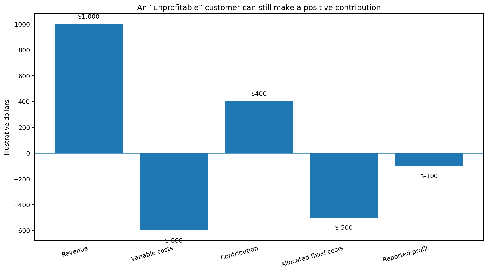
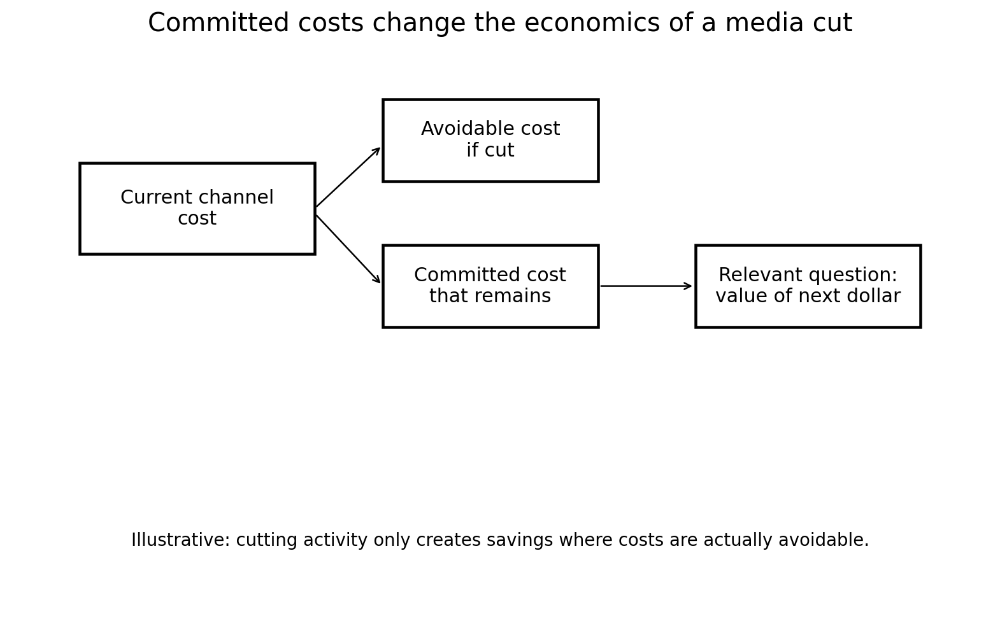

```{=html}
<header class="site-header">
    <h1 class="site-title">The Marketing Scientist</h1>
    <nav class="site-nav">
        <a href="../index.html" class="nav-link">Home</a>
        <a href="../articles.html" class="nav-link">Articles</a>
    </nav>
</header>
```

In marketing, we’re overly obsessed with ROAS, but business reality can very easily show why the obsession is unjustified. 

A customer can be unprofitable and still be worth keeping. A media channel can generate mediocre ROAS and still make economic sense. 

Customers, products, channels, teams, contracts, distributors and infrastructure share costs and depend on each other. Prioritizing ROI over sales volume can easily lead you to the wrong business decision. 

We're continuously asking ourselves if our investments and assets are profitable. **What if our efforts are necessary to keep the business afloat?** 

## An unprofitable customer may still be contributing 

Customer profitability needs to account for allocated fixed costs. 

Say a customer generates \$1,000 in revenue, requires \$600 in variable costs, and is allocated another \$500 in corporate, servicing, technology, or administrative costs. On paper, the customer loses \$100. It seems obvious that the company should get rid of them. 

**But what happens if the customer leaves?** 

The \$1,000 in revenue disappears, the \$600 in variable costs may disappear. But very little of the \$500 in allocated fixed costs does. 

The company still needs its technology stack, finance organization, office, management structure, customer service infrastructure and other shared capabilities. 

**The customer that appeared to lose \$100 may actually have been contributing \$400 toward costs the company was going to incur anyway**. Once the customer disappears, the corresponding fixed costs get allocated across remaining customers. 

In this case, the customer P&L improves, but the business may not. Before terminating an “unprofitable” customer ask yourself if your improving returns or **failing to cover your fixed costs**. 

**Which costs actually disappear if this customer leaves?** 

{width=95% fig-align="center"}

## The same logic applies to media 

Marketing decisions often suffer from the same problem. 

Assume a company has committed to an annual television agreement, radio contract, sponsorship package, agency retainer, or a minimum platform spend. 

Midway through the year, the company evaluates the channel and concludes it's inefficient compared to other media channels. The instinct may be to cut the channel, but if contractual costs have already been committed, cutting activity doesn't necessarily create equivalent savings. The economics have changed. 

**Given the cost we are already committed to, what is the best way to extract value from it?** 

This is a key consideration in partnerships with media owners, agencies, technology vendors and large platforms. Annual commitments, minimum-spend thresholds, negotiated rates, rebates, service levels, or broader commercial agreements can make the economics of the next dollar very different from the economics implied by a channel ROAS measurement. 

**A channel with relatively poor ROAS may still make sense to maintain if much of its associated cost cannot actually be recovered**. That does not mean continuing to spend indefinitely because money has already been committed. 

By this point, it should be obvious to you that agency spend pre-commitments with platforms like Google, TicToc or Meta, will force the agency to either show a better ROAS form this platforms or ask their clients to spend more on this platforms based on other "marketing requirements", **so beware a part of the media spend the agency is asking you to make is a sunk cost!** 

{width=95% fig-align="center"}

## There is also an organizational capacity problem 

The same issue can exist with people. 

Imagine a company has built an internal team around a particular media channel. There are specialists, analysts, creative resources, platform expertise and perhaps an agency retainer dedicated to supporting it. 

The company then sees that the channel has lower ROAS than another channel and decides to reduce spend. Well, **the payroll doesn't disappear, the agency retainer doesn't disappear**. Can these resources immediately be redeployed somewhere more productive? I doubt so. 

The company may save the variable media spend while carrying the burden of the operating costs associated with the channel. 

The important point is that the economics of reducing media investment depend partly on whether the capacity supporting that investment is avoidable, re-deployable or fixed over any decision horizon. 

Even if a team can be reassigned to a higher-value activity, the opportunity cost becomes relevant. If the team cannot be redeployed and its cost remains unchanged, then the savings from a channel spend cut are overstated. 

**Again, ROAS alone cannot answer the question**. 

## An unprofitable SKU can protect a profitable portfolio 

A product can look unattractive when evaluated on its own: Perhaps its gross margin is low, its inventory turns are weak, or it generates very little profit. 

A first SKU-level profitability analysis might suggest discontinuing it. 

However, it might be required to maintain a distributor agreement, or it might complete an assortment required by a retailer. The SKU might also help the company meet minimum inventory or volume requirements, secure shelf space, or make a broader product bundle attractive, or help acquire customers who later purchase much more profitable products. 

By removing the SKU with low ROI, part of the distributor relationship, shelf presence, customer acquisition and/or profitability of the rest of the portfolio will also be punished. 

## Fixed does not mean fixed forever 

There is a complication. A cost that cannot be removed today will always be removable. 

* Removing one customer may not allow a company to reduce its customer service organization, but removing 500 customers might. 
* Cutting 10% of a channel may not change agency or payroll costs. Exiting the channel completely might eliminate an entire team or contract. 
* Dropping one SKU may not change warehouse requirements. Dropping an entire product line might. 

Many costs behave more like **step costs** than perfectly fixed costs, they only fall once the business crosses a threshold. 

The correct analysis also depends on the decision horizon and the scale of the proposed change: A cost can be fixed for next month and variable over the next two years. 

## Profitability should be evaluated at the decision level 

None of this is an argument for keeping bad customers, bad media investments or bad products, but we need to evaluate them at the correct economic level. 

Before removing something that appears unprofitable, I would want to understand at least five things: 

* **Avoidable costs:** Which costs actually disappear? 
* **Contribution:** What cash contribution is lost along with the activity? 
* **Committed costs:** What expenses remain because of contracts or prior commitments? 
* **Opportunity cost:** Can the resources used here generate more value elsewhere? 
* **Portfolio effects:** What other revenue, contracts, capabilities, or commercial relationships depend on this activity? 

This is one of the reasons I think marketing performance can become distorted when we reduce every decision to ROAS. ROAS tells us something important about the relationship between marketing spend and revenue, **but it doesn't tell us how the rest of the business changes**.


```{=html}
<section class="article-cta">
  <p class="article-cta-question"><strong>Trying to decide whether an “unprofitable” customer, channel, SKU, or team is still economically worth keeping?</strong></p>
  <p class="article-cta-description">
    I advise executives on measurement strategy, marketing economics, and Marketing Science product and vendor decisions.
  </p>
  <a
    class="article-cta-button"
    href="https://calendly.com/andres-themarketingscientist/some-context"
    target="_blank"
    rel="noopener noreferrer"
  >
    Schedule a call
  </a>
</section>
```


```{=html}
<div class="connect-section">
  <div class="linkedin-button">
    <a href="https://www.linkedin.com/in/themarketingscientist" target="_blank">
      <i class="bi bi-linkedin"></i>
      The Marketing Scientist
    </a>
  </div>
</div>
```
